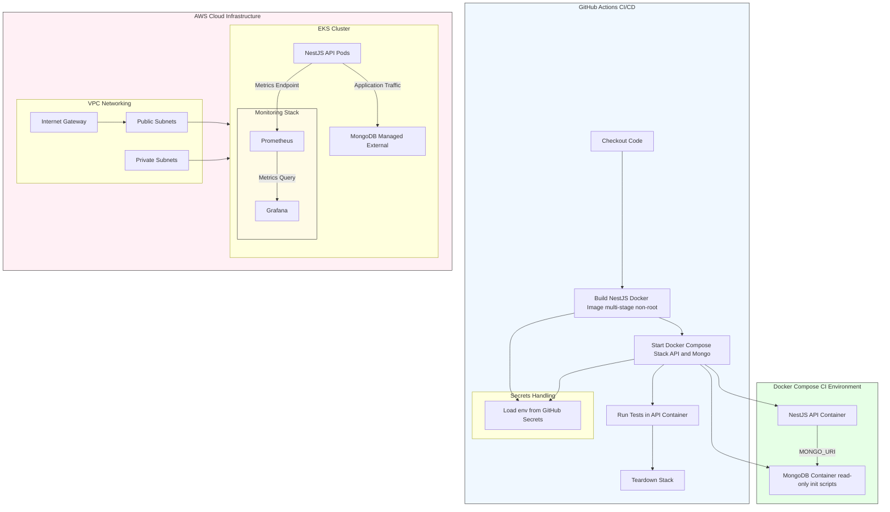

# NestJS + MongoDB Deployment Challenge  
## Architecture & Deployment Report

## 1. Docker Architecture

### 1.1 Base Image Selection

**NestJS API**

- **Node.js 20 (Alpine)**
  - Lightweight Alpine base significantly reduces image size (~50MB).
  - Smaller attack surface due to minimal system libraries.
  - Active LTS version and fully compatible with NestJS 10+.

**MongoDB**

- **MongoDB 8 Official Image**
  - Official, vendor-maintained image with security updates.
  - Supports `docker-entrypoint-initdb.d/` for deterministic database initialization.
  - Avoids custom database bootstrapping logic.

---

### 1.2 Multi-Stage Dockerfile

**Stage 1 – Builder**

- Uses **pnpm** with a frozen lockfile for deterministic installs.
- Installs **all dependencies**, including `devDependencies`, required for building.
- Compiles the NestJS application from TypeScript into production-ready JavaScript.
- Optimized layer caching:
  - `package.json` and `pnpm-lock.yaml` copied first.
  - Faster rebuilds during CI/CD when source code changes but dependencies do not.

**Stage 2 – Runner (Production)**

- Copies only:
  - Compiled application (`dist/`)
  - Dependency manifests
  - Installed `node_modules`
  - Initialization scripts
- Runs `pnpm prune --prod` to remove development dependencies.
- Runs as a **non-root user** (`nestjs`) to enforce least privilege.
- Explicitly sets `NODE_ENV=production`.
- Exposes only the required application port (`3000`).

**Benefits**

- Smaller and more secure images.
- Reduced attack surface and privilege escalation risk.
- Faster CI/CD pipelines due to effective layer caching.
- Clear separation between build-time and runtime concerns.

---

### 1.3 Initialization Strategy

**MongoDB Initialization**

- Initialization scripts (`mongo-init.js`) mounted **read-only** at  
  `/docker-entrypoint-initdb.d/`.
- Executed only on first container startup.
- Ensures:
  - Database creation
  - User provisioning
  - Initial schema and data availability

**NestJS Application Startup**

- Docker Compose enforces dependency on MongoDB via health checks.
- The API service starts only after MongoDB reports readiness.
- Test containers also wait for MongoDB health before execution.
- Prevents race conditions during startup.

---

## 2. Docker Compose Design

### 2.1 Service Definitions

**MongoDB Service**

- Uses the official MongoDB image.
- Credentials injected via environment variables.
- Health checks ensure database readiness before API startup.

**NestJS API Service**

- Built from a local multi-stage Dockerfile.
- Depends on MongoDB health status.
- Configuration and secrets injected via `.env`.
- Exposes port `3000` for external access.

**NestJS API Test Service**

- Uses `node:20-alpine` for parity with the production runtime.
- Mounts the project directory as a volume for live code access.
- Installs dependencies and runs tests using **pnpm**.
- Executes only after MongoDB is healthy, ensuring reliable test execution.

---

### 2.2 Security Considerations

- **Environment Variables**
  - `.env` file is gitignored.
  - Secrets injected dynamically via GitHub Actions secrets in CI.

- **Volumes**
  - MongoDB initialization scripts mounted read-only.
  - Database volumes are ephemeral in CI (`docker compose down -v`) to ensure test determinism.

- **User Privileges**
  - API container runs as non-root.
  - MongoDB runs with default permissions for initialization, but application access uses a dedicated DB user.

---

## 3. CI/CD Pipeline (GitHub Actions)

### 3.1 Build Strategy

- Triggered on:
  - Pushes to `main`
  - Pull requests targeting `main`
- Uses **Docker Buildx with BuildKit** for efficient image builds.
- Builds the production-ready image using the multi-stage Dockerfile.
- Pushes the image to **Amazon ECR** with the `latest` tag.
- Leverages GitHub Actions cache:
  - `cache-from: type=gha`
  - `cache-to: type=gha,mode=max`
- Enables:
  - Faster rebuilds
  - Reduced CI execution time
  - Deterministic image layers across runs

---

### 3.2 Test Strategy

- Integration tests run after a successful image build.
- Dynamically generates a `.env` file for the test environment inside the pipeline.
- Starts the full application stack using **Docker Compose**:
  - MongoDB service with initialization scripts
  - NestJS API service
- MongoDB readiness is enforced via container health checks.
- The stack is fully torn down using:
  - `docker compose down -v`
- Guarantees:
  - Isolated test environments per run
  - No state leakage between CI executions

> Note: Test execution is currently commented out due to missing test assets, but the infrastructure is fully in place for re-enablement.

---

### 3.3 Deployment Strategy (EKS)

- Deployment runs only after successful build and test stages.
- Infrastructure provisioning handled via **Terraform**:
  - `terraform init`
  - `terraform apply -auto-approve`
- Automatically configures `kubectl` access to the EKS cluster.
- Waits for cluster node readiness before proceeding.
- Applies Kubernetes manifests after:
  - Injecting AWS account ID and region dynamically
  - Creating required ConfigMaps and Secrets
- Ensures idempotent deployments using `kubectl apply`.

---

### 3.4 Secrets & Configuration Management

- Secrets are sourced exclusively from **GitHub Actions Secrets**.
- Environment configuration is generated dynamically during pipeline execution.
- Kubernetes Secrets are created from `.env` files using:
  - `kubectl create secret --from-env-file`
- MongoDB initialization scripts are injected via ConfigMaps.
- No credentials or sensitive data are committed to the repository.

---

### 3.5 CI Security Practices

- Principle of least privilege enforced:
  - Containers run as non-root users
  - IAM credentials scoped via GitHub Secrets
- Clear separation between:
  - Build
  - Test
  - Deploy stages
- Consistent runtime parity:
  - Node.js version
  - Base images
  - Dependency manager (`pnpm`)
- Clean teardown guarantees no leftover resources or state.

---

## 4. AWS Cloud Infrastructure (Terraform)

### 4.1 Kubernetes Platform Choice

**Amazon EKS (Managed Kubernetes)**

Chosen over self-managed Kubernetes to reduce operational overhead.

Provides:

- Managed control plane
- Secure IAM integration for workloads and nodes
- Automated patching and upgrades

---

### 4.2 Networking Architecture

- Custom VPC (`10.0.0.0/16`) for environment isolation.
- **Public Subnets**
  - Host load balancers.
- **Private Subnets**
  - Host worker nodes.
  - Reduce exposure to the public internet.
- Internet Gateway attached only to public subnets.

---

### 4.3 Node Groups

- Managed node groups using `t3.small` instances for free tier usage.
- Autoscaling boundaries defined (min/max capacity).
- Kubernetes best practices enforced (non-root pods by default).

---

### 4.4 Security Controls

- Sensitive Terraform outputs (e.g., kubeconfig) marked as sensitive.
- Worker nodes use least-privilege IAM roles.
- Strict separation between public and private networking layers.

---

### 4.5 Terraform Modules

- Uses `terraform-aws-modules/eks/aws`.

**Benefits**

- Secure defaults
- Simplified cluster provisioning
- Multi-AZ support
- Seamless CI/CD integration

---

## 5. Security Summary

| Layer | Implementation |
|------|---------------|
| Docker Images | Minimal base images, non-root users |
| MongoDB Init | Read-only scripts, one-time initialization |
| Secrets | `.env` + GitHub Secrets, never committed |
| CI/CD | Ephemeral Compose stacks, deterministic builds |
| Kubernetes (EKS) | Private subnets, IAM roles, managed nodes |
| Networking & Volumes | Isolated VPC, private DB volumes |

---

## 6. Monitoring & Observability

### 6.1 Monitoring Stack Overview

The deployment includes a **Prometheus + Grafana monitoring stack** running inside the Kubernetes cluster to provide metrics collection, visualization, and operational visibility for the NestJS application.

- **Prometheus** is responsible for metrics scraping and storage.
- **Grafana** provides dashboards and visualization over Prometheus data.
- Both components are deployed as Kubernetes workloads and exposed internally via `ClusterIP` services.

This design aligns with cloud-native observability best practices and avoids exposing monitoring endpoints publicly.

---

### 6.2 Prometheus Configuration

**Prometheus Deployment**

- Deployed as a single-replica `Deployment`.
- Uses the official `prom/prometheus` image.
- Configuration is injected via a Kubernetes `ConfigMap`, mounted at `/etc/prometheus`.

**Key Configuration Highlights**

- Global scrape interval set to **15 seconds**, balancing freshness and overhead.
- Uses **Kubernetes service discovery (`kubernetes_sd_configs`)** with `role: pod`.
- Relies on **label-based filtering** to target only the NestJS API pods.

---

## 7. Design Rationale

- **Multi-stage builds** → smaller, more secure images  
- **Alpine-based Node.js** → reduced attack surface  
- **Health checks & Compose dependencies** → reliable CI testing  
- **Read-only init scripts** → prevent accidental DB modification  
- **Terraform + EKS** → repeatable, production-grade infrastructure  
- **Secrets via CI** → avoid hardcoded credentials  
- **Prometheus + Grafana** → industry-standard tools for Kubernetes observability

---

## Overall Objective

Deliver a **secure, repeatable, and production-aligned deployment** of a NestJS + MongoDB application on AWS, backed by a CI/CD pipeline that closely mirrors real production behavior.

---

